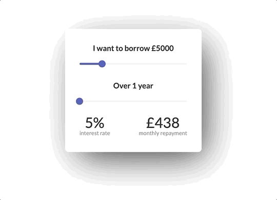

## How this app works

- As a user drags the sliders, their onChange handlers dynamically set the App component state with their values.
- The Display component takes the App state values as 'year' and 'amount' props respectively and uses their values to automatically calculate both 'APR' percentages and a monthly repayment.
- Both APR and repayments are displayed within a reusable DisplayChild component.

## Preview

## Demo 

https://codepen.io/GavBarosee/pen/PVwMvG

## Installation

### Setup

- Clone the repository or download the zipped folder
- From your terminal, `cd` into the folder
- Run the command `npm i` to install the dependencies
- To run the application type `npm start` after installing the dependencies

### Tests

- While still in the directory from your terminal, run `npm run test` to run any default snapshot tests

## Documentation

### Amount Range Slider

- A controlled component that can accept number values between 1000 and 20000
- Increases or decreases by a number value of 100 at a time ('step' prop)

### Years Range Slider

- A controlled component that can accept number values between 1 and 5
- The values indicate the amount of years rather than months
- Increases or decreases by a number value of 0.5 years at a time ('step' prop), to represent changes of 6 months at a time

### Display component

- Must have two props: 'years' and 'amount', both values are numbers.

### DisplayChild component

- Must have two props: 'func' and 'text'. 'Func' takes in a function as its value and 'text' a string.
